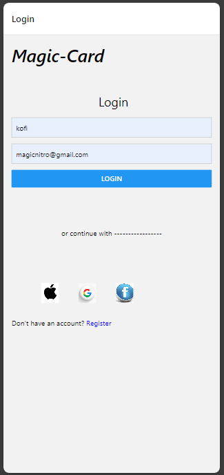
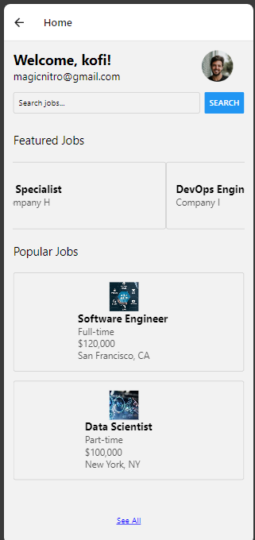
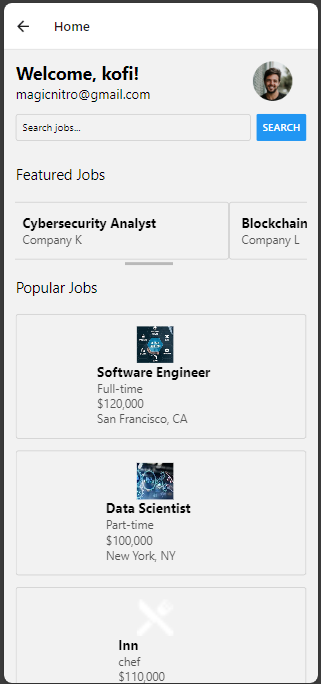

# rn-assignment4-11254373

Components

1. App.js
   Usage: This is the main entry point of the app. It sets up the navigation stack and includes the LoginScreen, HomeScreen, and RegisterScreen components.
2. LoginScreen.js
   Usage: This component renders the login screen where users can enter their name and email. Upon pressing the login button, the user is navigated to the HomeScreen with the entered details.
3. HomeScreen.js
   Usage: This component displays the home screen with the user's name and email, a search bar, and lists of popular and featured jobs.
   Popular Jobs: Displays the first two jobs initially and can show more upon pressing the "See All" button. The jobs are displayed with an icon, job name, position, salary, and location.
   Featured Jobs: Displays jobs in a horizontal scrollable list.
4. JobCard.js
   Usage: This component is used to display individual job cards with job details such as title, position, salary, location, and an icon.

   Screenshots
   

   Home Screen
   

   

id:11254373
